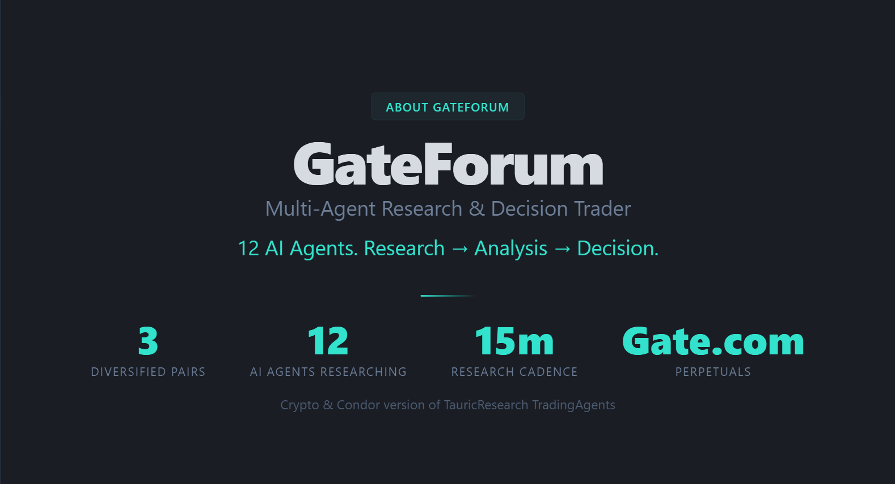

# GateForum



An interpretable 12-role research council for Gate.io perpetuals. Four analysts brief the book, a bull and a bear argue, a research judge rules, then three risk analysts size the idea. Only BUY/SELL verdicts that clear 65% consensus become positions. Hummingbot V2 `position_executor` owns the lifecycle. Condor never trades on a dead or stale council.

Not a hummingbot/condor fork. Drop `agents/gateforum/` into a Condor checkout.

```bash
./.venv/bin/python agents/gateforum/tests/validate_agent.py
```

## What it does

GateForum is a directional desk on Gate.io USDT-margined perpetuals. It does not emit a single-model signal. Every 15 minutes it convenes twelve specialised LLM roles on three deliberately uncorrelated books — BTC-USDT, XAU-USDT (gold), and CL-USDT (WTI). Intelligence is gathered in parallel, then subjected to two adversarial research rounds and a three-seat risk desk. The Condor tick reads the verdict table, opens only what the floor earned, and journals the argument. The research transcript is the product: a judge can read why a ticket existed.

Signal and execution are separate layers. Routines never touch an exchange connector. The venue lives in `default_trading_context` (`gate_io_perpetual`). Moving the same council to another perp venue is a one-line config change.

## Core logic

1. **Health gate.** `gateforum_init` must see the research server on `127.0.0.1:8500`. If it is down, the tick stops. No leftover verdicts.
2. **Briefing.** `gateforum_data` builds candle + fundamentals packets for BTC, gold, and crude.
3. **Phase 1 — intelligence.** Market, social, news, and fundamentals analysts run in parallel.
4. **Phase 2 — adversarial.** Bull and bear argue for two sequential rounds. A research judge issues the analysis ruling and a stated `CONVICTION: 0–100`.
5. **Phase 3 — risk.** Aggressive, neutral, and conservative analysts speak. The risk judge may HOLD only when **at least two of those three** also lean HOLD. A lone cautious veto is overruled; disagreement only cuts confidence.
6. **Verdict.** Confidence blends research-judge conviction (primary) with risk-judge conviction (60/40 when both stated), then applies a small alignment bonus or contested/contrarian penalty. BUY/SELL never report below 65. Cap 95.
7. **Must-open.** Every pair with `Actionable = YES` (≥65%) gets a slot, ranked by confidence, up to three concurrent names. Standing aside on a cleared verdict is treated as a failure.
8. **Skip-pair uses exchange truth.** A pair is already open only if net notional (LONG positive, SHORT negative) is ≥ $1. Offsetting dust does not consume a slot.
9. **Size.** 65–74% → 8% of balance · 75–84% → 12% · ≥85% → 16%. Always 2×. Drawdown scales the same ticket: 0–4% full, 4–8% half, >8% quarter with a 10–15 minute time limit. Never a dead stop.
10. **Barriers.** Every create is a `position_executor` with stop 2%, take 4%, 1 hour time limit, trailing activation 1% / delta 2%. The risk gate refuses unprotected or over-levered tickets.
11. **Volume cadence.** Every second tick (30 minutes): close **losing** positions only, put that pair on a 15-minute cooldown, then re-evaluate from a fresh ≥65% verdict. Winners ride their barriers.
12. **Journal.** One entry per tick, including a mandatory `Cooldowns:` line. The public floor on `:8600` shows the latest ruling in plain words.

## Safety

The intended race envelope is **$800**, **2× leverage**, **max 3** concurrent names, **$96** max quote per ticket, platform-required triple barrier + trailing stop. The LLM cannot open a naked position even if it tries.

Known honest limits:

- Research timeout is 300 seconds. If the blocking run still returns stale, the tick HOLDs. It does not reuse the previous verdict.
- Gate hedge-mode closes need `reduce_only` on CLOSE. Without that connector behaviour, "closes" can open the other leg and leave offsetting dust. The playbook treats |net| < $1 as dust and ignores it for the open-pair check.
- `controller_id` must sit **inside** `executor_config` or the risk gate silently cancels the create.
- Gold and crude have venue minimums. Size must clear the contract, then the $96 cap.

No GPU. Two LLM layers (council + Condor tick).

## Repository layout

```
agents/gateforum/
  AGENT.md
  routines/gateforum_init.py
  routines/gateforum_data.py
  routines/gateforum_research.py
  server/research_engine.py
  server/gateforum_server.py
  server/gateforum_public.py
  server/gateforum_loop.py
  server/gateforum_config.yaml
  server/gateforum_heal.py
  server/gateforum_bootcheck.sh
  strategies/gateforum_debate_operator/strategy.md
  tests/validate_agent.py
  tests/smoke_server.py
  tests/smoke_market_data.py
```

Strip before zipping for submission: `server/session_state.json`, `strategies/**/sessions/`, `__pycache__/`, any `.env`.
